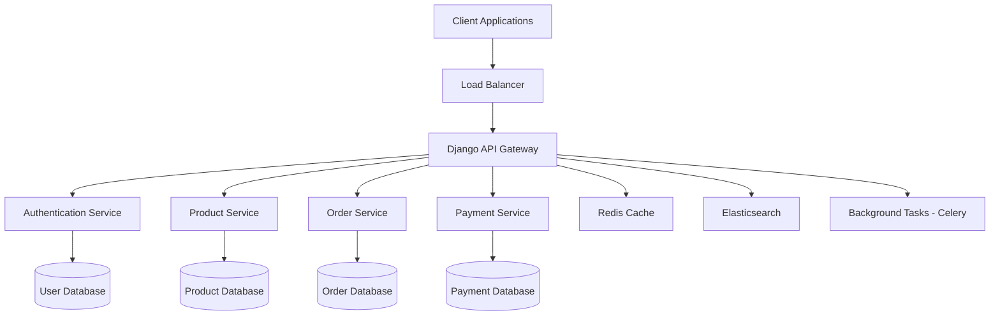

## 🏗️ Architecture

ALX Project Nexus follows a **modular, microservices-inspired architecture** within a Django monolith, ensuring scalability and maintainability.

### 🔧 Design Patterns
- **Repository Pattern** for data access abstraction
- **Factory Pattern** for payment gateway selection
- **Observer Pattern** for event-driven notifications
- **Strategy Pattern** for shipping calculations
- **Decorator Pattern** for API permissions and caching
